# Bài tập — Mổ App AI: Vietnam Airlines NEO

**Sản phẩm chọn:** Vietnam Airlines — Chatbot NEO  
**Evidence:** Transcript + 3 screenshot chat Web VNA  
**Ngày:** 03/06/2026  
**Học viên:** Nguyễn Minh Hiếu — 2A202600705

---

## 1. Dùng thử — Promise vs Reality

### Product hứa gì?

Theo [trang NEO chính thức](https://www.vietnamairlines.com/vn/vi/support/chatbot):

> *"Thuận tiện tra cứu, giải đáp nhanh chóng (24/7) mọi thắc mắc liên quan đến thông tin hành trình, mua vé, thanh toán..."*

NEO hứa: tra cứu vé/chuyến bay, **tìm kiếm giá vé**, giải đáp hoàn/đổi vé, hành lý — chat ngắn gọn, rõ ràng.

### 3 query đã thử (chat thật)

| # | Prompt | Kết quả | Path |
|---|---|---|---|
| 1 | *"hoàn tiền chuyến bay"* | Trả FAQ chi tiết, đúng quy trình hoàn vé online/offline + thời gian hoàn tiền | **Happy** |
| 2 | *"tiền vé bao nhiêu tiền"* | Chuyển sang slot-filling: hỏi loại vé, điểm đi/đến, ngày, hành khách, hạng | Low-confidence → Failure |
| 3 | *"một chiều HN → HCM, 1 người lớn, hạng thương gia"* + *"bao nhiêu tiền vé"* (×2) | Thu thập đủ slot trừ **Ngày đi** — lặp lại cùng template 3 lần, **không trả giá** | **Breaking point** |

### Điểm gãy chính (từ transcript)

1. **Loop slot-filling cứng:** User hỏi giá 3 lần (*"bao nhiêu tiền vé"*, *"hạng thương gia thì bao nhiêu tiền"*) — NEO chỉ lặp *"Vui lòng cung cấp: Ngày đi"*, không giải thích vì sao, không đưa khoảng giá tham khảo.
2. **Intent bị hiểu sai mức độ:** User có thể chỉ muốn **ước lượng giá** (research), không phải đặt vé — NEO ép vào flow booking đầy đủ slot.
3. **Không nhận diện user đang stuck:** Cùng một block text lặp lại → cảm giác bot "đơ", không nghe câu hỏi mới.
4. **CSAT sớm:** Sau câu hoàn tiền, NEO hỏi đánh giá 1–5⭐ trong khi user chưa hoàn thành task tra giá vé.

---

## 2. Screenshot — chat thật (Web VNA)

### Ảnh 1 — Query #1: Hoàn tiền (Happy path)

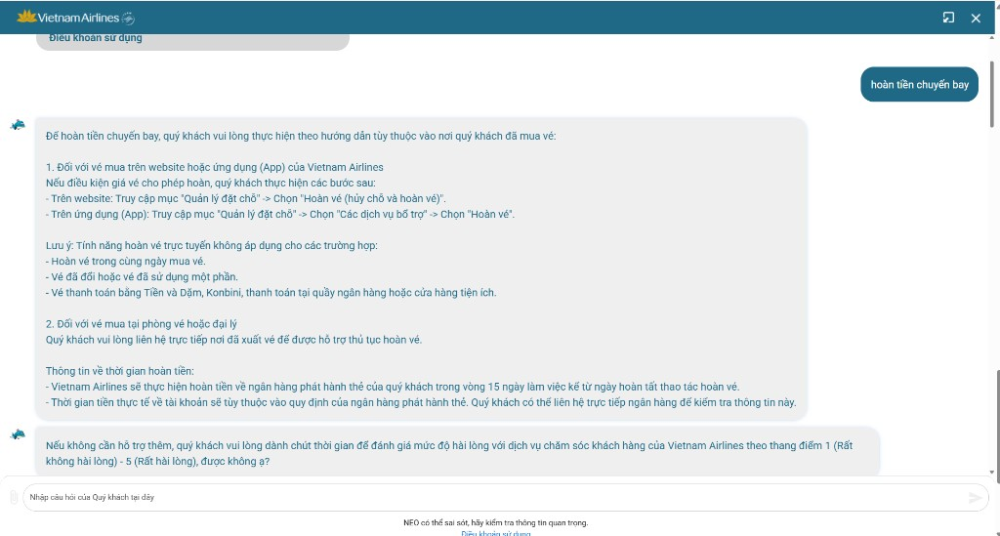

*User: "hoàn tiền chuyến bay" → NEO trả hướng dẫn website/app/đại lý, timeline 15 ngày, sau đó hỏi đánh giá.*

---

### Ảnh 2 — Query #2: Bắt đầu slot-filling giá vé

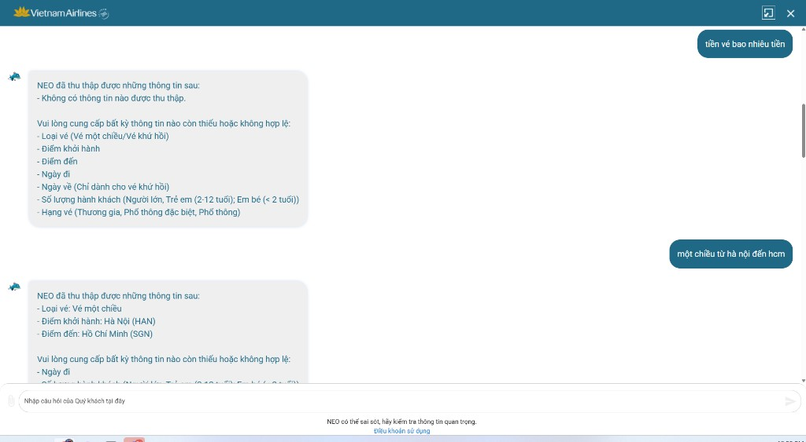

*User: "tiền vé bao nhiêu tiền" → chưa có info. User bổ sung "một chiều HN → HCM" → NEO cập nhật HAN/SGN, vẫn thiếu ngày đi, hành khách, hạng.*

---

### Ảnh 3 — Query #3: Loop khi hỏi giá (Breaking point)

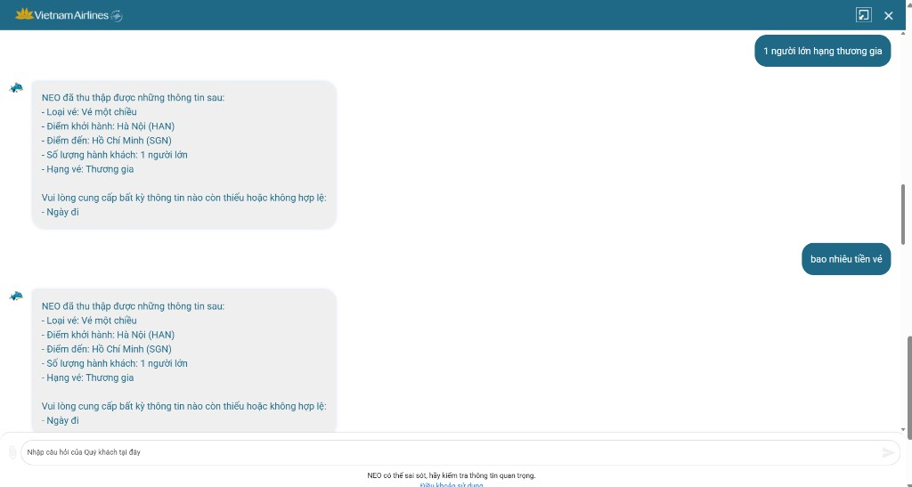

*Đã có: một chiều, HAN→SGN, 1 NL, hạng thương gia. User: "bao nhiêu tiền vé" → NEO **lặp y hệt** block "Thiếu: Ngày đi", không trả giá.*

---

## 3. Transcript rút gọn (evidence)

```text
User: hoàn tiền chuyến bay
NEO: [FAQ hoàn vé chi tiết — OK ✅]
NEO: Đánh giá 1–5 sao?

User: tiền vé bao nhiêu tiền
NEO: Slot-filling — thiếu tất cả fields

User: một chiều từ hà nội đến hcm
NEO: Đã có HAN→SGN, một chiều — thiếu ngày đi, hành khách, hạng

User: 1 người lớn hạng thương gia
NEO: Đủ trừ Ngày đi — thiếu ngày đi

User: bao nhiêu tiền vé          ← lần 1
NEO: [Lặp lại — thiếu Ngày đi]

User: hạng thương gia thì bao nhiêu tiền  ← lần 2
NEO: [Lặp lại y hệt — thiếu Ngày đi]  ❌

User: (implicit lần 3 — cùng pattern)
NEO: [Lặp lại y hệt]  ❌
```

---

## 4. Vẽ 4 paths (Mermaid)

### Tổng quan session chat thật

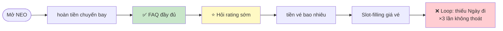

---

### Path 1 — Happy (hoàn tiền)

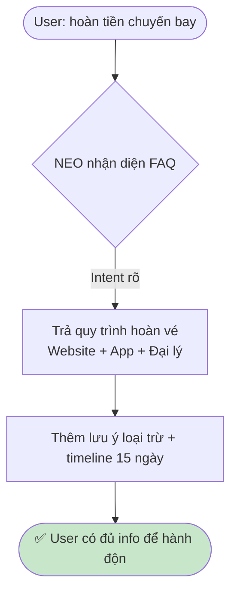

---

### Path 2 — Low-confidence (thiếu slot — nhưng xử lý kém)

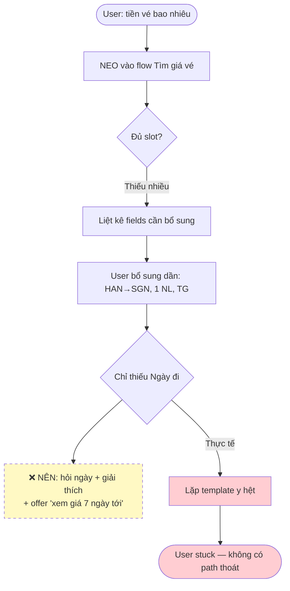

---

### Path 3 — Failure (loop + bỏ qua câu hỏi)

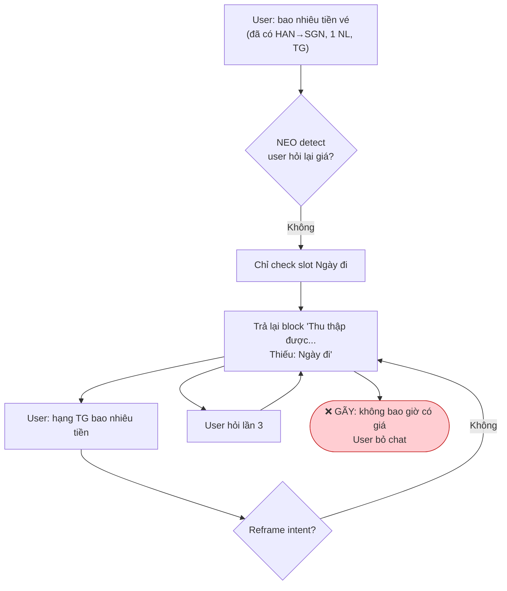

**Failure mode:** User có **4/5 slot** nhưng không được trả **bất kỳ thông tin giá nào** — kể cả khoảng tham khảo.

---

### Path 4 — Correction (user cố sửa bằng cách nói rõ hơn)

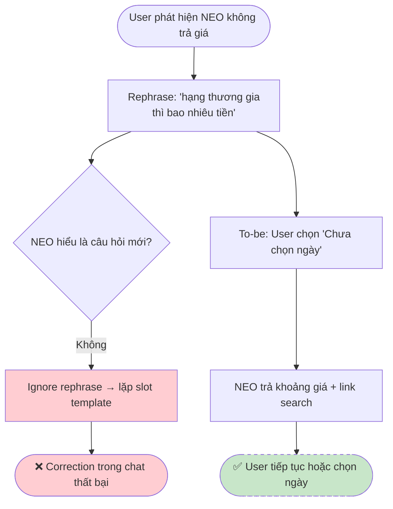

**Human handoff:** Trang VNA nói có chuyển tư vấn viên khi NEO không giải quyết được — **không xuất hiện** trong transcript này.

---

## 5. Path yếu nhất — chọn để sửa

**Path yếu:** *Tra giá vé khi user chưa có / không muốn chốt ngày bay*.

**Không phải bug lẻ:** Đây là workflow research phổ biến — user hỏi *"HN–SGN thương gia khoảng bao nhiêu"* trước khi quyết định ngày.

---

## 6. Finding → Product decision

```
Khi user đã cung cấp đủ route + hành khách + hạng vé nhưng chưa có ngày đi,
NEO lặp lại cùng template yêu cầu "Ngày đi" và bỏ qua câu hỏi "bao nhiêu tiền",
hậu quả là user bị kẹt trong loop, không nhận được khoảng giá tham khảo và bỏ chat.
Lỗi thuộc layer Intent + UX Recovery.
Nên sửa bằng: (1) nhận diện câu hỏi lặp → đổi chiến lược;
(2) offer "Xem giá rẻ nhất 7 ngày tới" hoặc khoảng giá;
(3) chip "Chưa chọn ngày — xem giá tham khảo";
(4) human handoff sau 2 lần stuck.
```

### Một câu quyết định product

> **NEO không được block hoàn toàn khi thiếu ngày bay — phải trả giá tham khảo hoặc lịch giá rút gọn trước khi ép user chốt ngày.**

---

## 7. Sketch As-is / To-be (Mermaid)

### So sánh As-is vs To-be

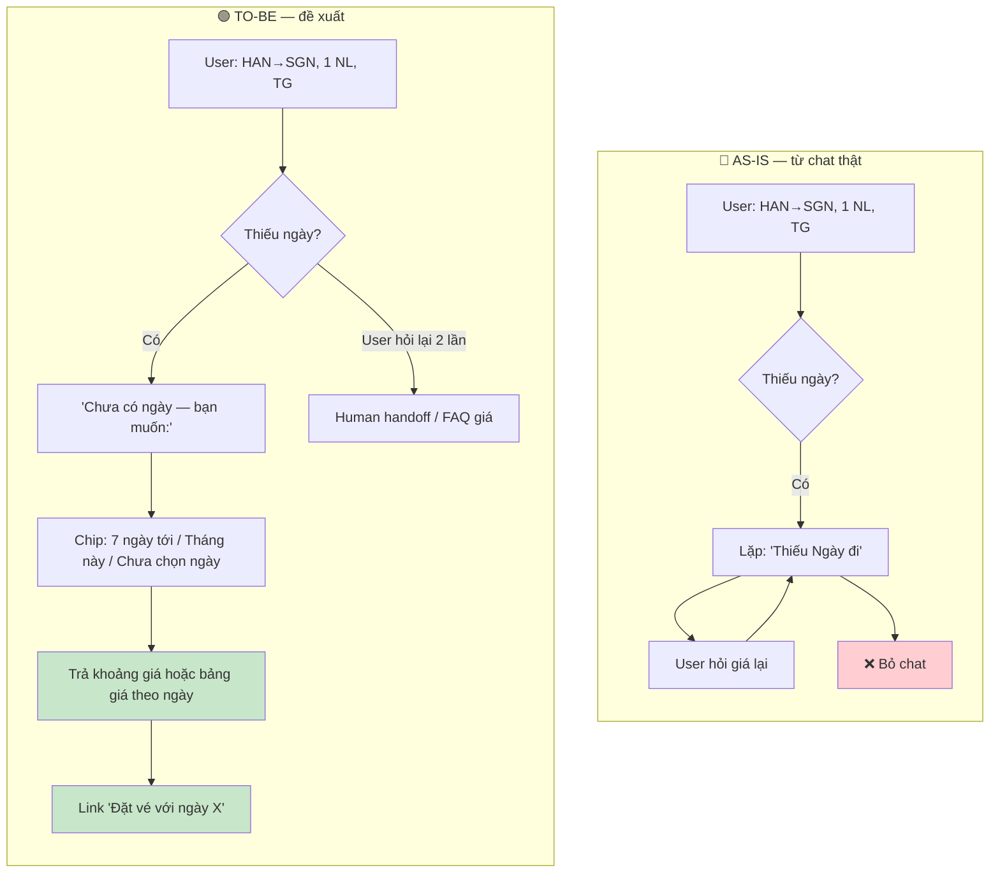

---

### As-is — chi tiết path giá vé

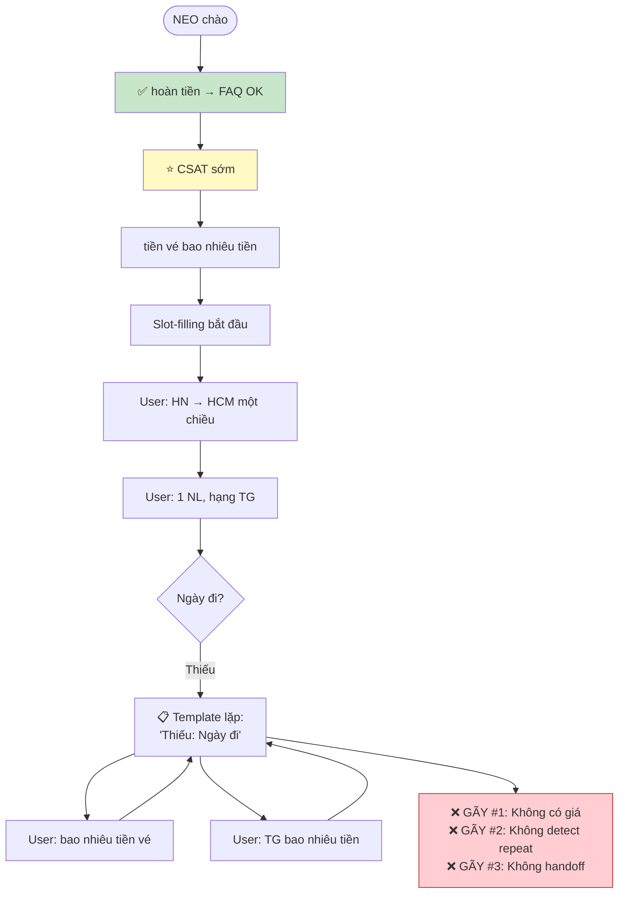

---

### To-be — path đã sửa

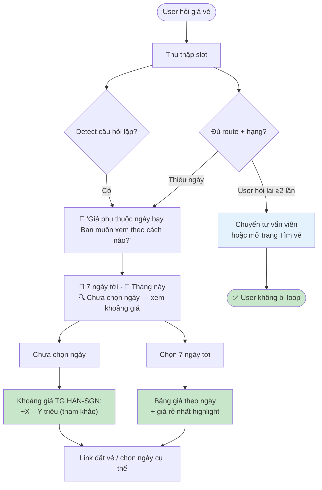

---

### Sequence — To-be (User ↔ NEO)

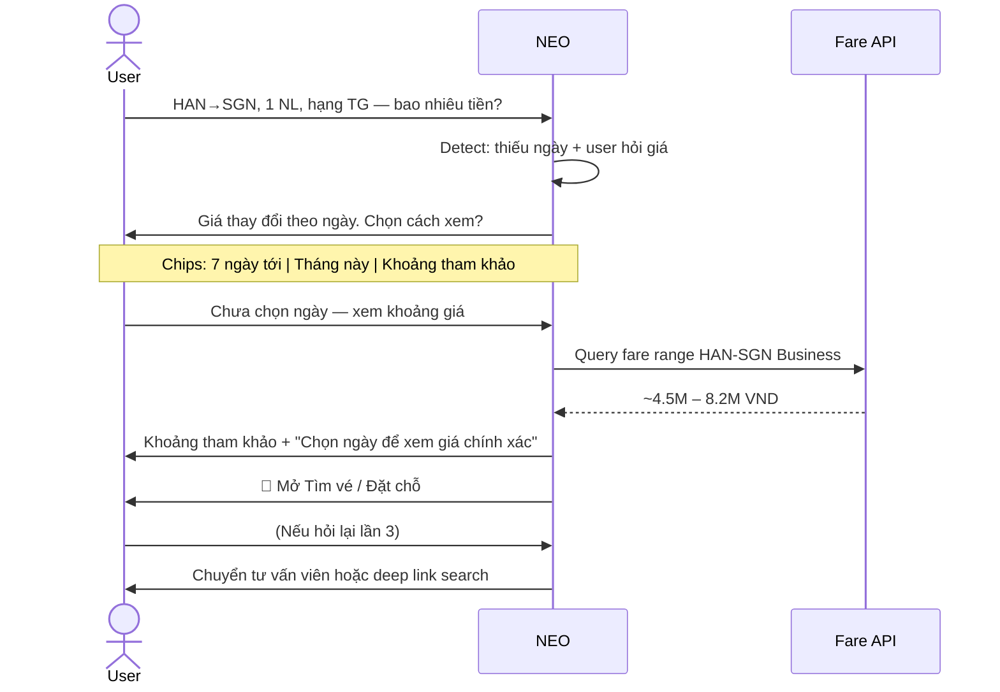

---

## 8. Tự kiểm

- [x] Evidence chat thật (transcript)
- [x] Screenshot app (3 ảnh — `screenshots/`)
- [x] Đủ 4 paths
- [x] Finding = product decision
- [x] Mermaid as-is + to-be

---

## 9. Build slice Day 06 (track VNA)

```text
Cho hành khách đang research giá vé chưa chọn ngày bay,
prototype dùng AI detect "price inquiry without date" và offer 3 lựa chọn xem giá,
tạo ra khoảng giá tham khảo hoặc bảng 7 ngày,
và xử lý loop failure bằng repeat-detection + human handoff sau 2 lần stuck.
```

